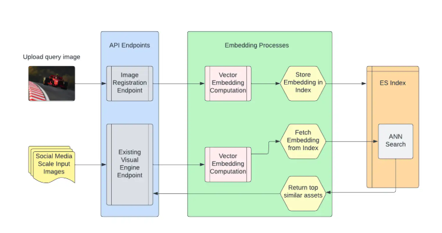

## Feature Vector Extraction
Vector embeddings are high-dimensional vectors used to represent data points, such as words, sentences or images, in a continuous vector space. Each dimension of the vector captures some aspect of the data's meaning or context, allowing seemingly disparate forms of content to be compared and analyzed based on their semantic and contextual similarities. This representation is crucial for processing and understanding the vast and varied data encountered in social media. 

## Image Retrieval
Elastic Search, a powerful search and analytics engine known for its scalability and performance. With the introduction of version 8 and above, Elastic Search has added support for approximate nearest neighbor (ANN) search and vector type fields. These features are integral to our Reverse Image Search technology. By creating indexes directly on Elastic Search, we leverage its ability to handle the load of social media scale content efficiently. This ensures that our vector search service can quickly and accurately process search requests, providing users with timely and relevant results.

# Neigborhood Blending 

